<!--
Title: How to setup hardened Ubuntu environment on Intel computer
Description: Learn how to setup air-gapped and non-persistent Ubuntu environment running on Intel computer.
Author: Sun Knudsen <https://github.com/sunknudsen>
Contributors: Sun Knudsen <https://github.com/sunknudsen>
Reviewers:
Publication date: 2023-02-13T21:06:22.975Z
Listed: true
-->

# How to setup hardened Ubuntu environment on Intel computer

## Requirements

The following hardware is required.

- Computer [compatible](https://ubuntu.com/download/desktop) with Ubuntu 22.04.1 LTS
- USB flash drive (used to create Ubuntu for desktops bootable installer, 4GB min)
- USB flash drive (used to install Ubuntu for desktops, 16GB min)

## Recommendations

Physically removing internal disk(s) and wireless interface(s) if not soldered to motherboard or disabling interface(s) using BIOS if soldered is recommended to strengthen data persistence and air gap hardening.

Installing Ubuntu for desktops on [datAshur PRO²](https://istorage-uk.com/product/datashur-pro2/) USB flash drive is recommended to enforce access control, data persistence and tamper resistance hardening.

## Bootable installer creation guide

### Step 1: install [Raspberry Pi Imager](https://www.raspberrypi.com/software/)

#### macOS

Go to https://www.raspberrypi.com/software/, download and install Raspberry Pi Imager.

#### Ubuntu (or other Debian-based OS)

> Heads-up: depends on [Qt](https://www.qt.io/).

```shell-session
$ sudo add-apt-repository -y universe

$ sudo apt install -y rpi-imager
```

### Step 2: disable Raspberry Pi Imager [telemetry](https://github.com/raspberrypi/rpi-imager#telemetry)

#### macOS

```shell-session
$ defaults write org.raspberrypi.Imager.plist telemetry -bool NO
```

#### Ubuntu (or other Debian-based OS)

```shell-session
$ mkdir -p ~/.config/Raspberry\ Pi

$ cat << "EOF" > ~/.config/Raspberry\ Pi/Imager.conf
[General]
telemetry=false
EOF
```

### Step 3: download [Ubuntu for desktops](https://ubuntu.com/desktop)

> Heads-up: for additional security, [verify](https://ubuntu.com/tutorials/how-to-verify-ubuntu) Ubuntu for desktops download.

Go to https://ubuntu.com/download/desktop and download Ubuntu 22.04.1 LTS.

### Step 4: create Ubuntu for desktops bootable installer

Open “Raspberry Pi Imager”, click “CHOOSE OS”, then “Use custom”, select Ubuntu for desktops `.iso`, click “CHOOSE STORAGE”, select USB flash drive and, finally, click “WRITE”.

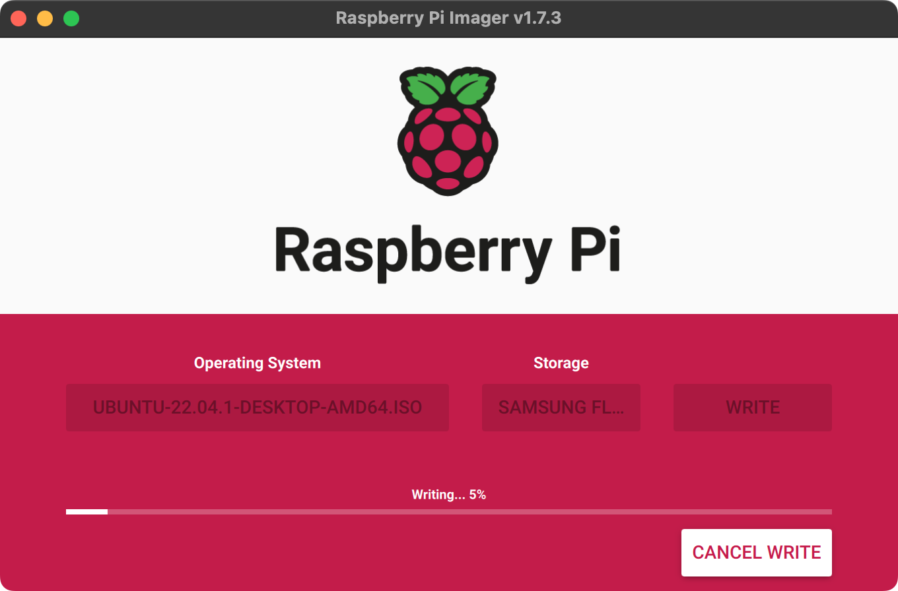

👍

## Installation guide

### Step 1 (optional): physically remove internal disk(s)

### Step 2 (optional): initialize datAshur PRO² and enable bootable mode (see product [documentation](https://istorage-uk.com/product-documentation/) for instructions)

### Step 3: insert both USB flash drives into computer

### Step 4 (if applicable): enable “Secure Boot” and disable “Boot Order Lock”


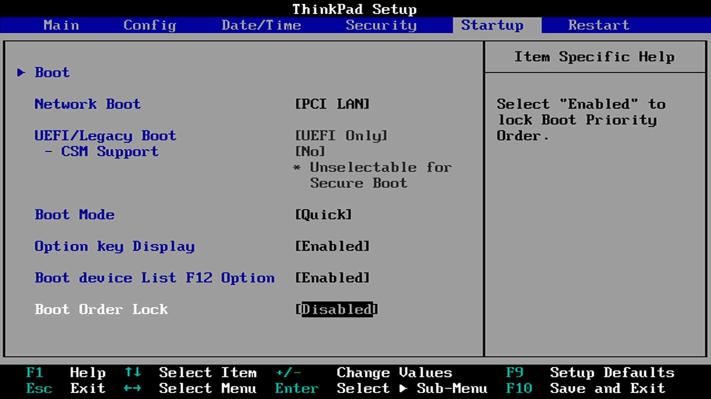

### Step 5: boot to Ubuntu for desktops bootable installer and select “Try or Install Ubuntu”

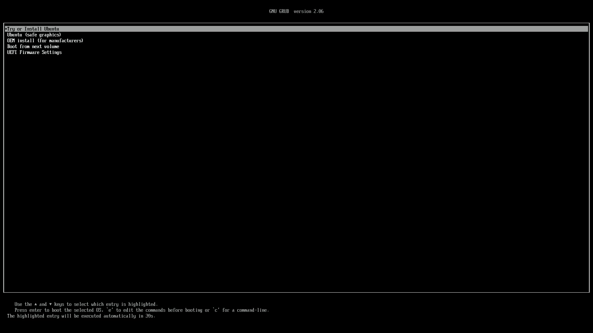

### Step 6: connect Ethernet cable or connect to Wi-Fi network

### Step 7: install Ubuntu

#### Click “Install Ubuntu”

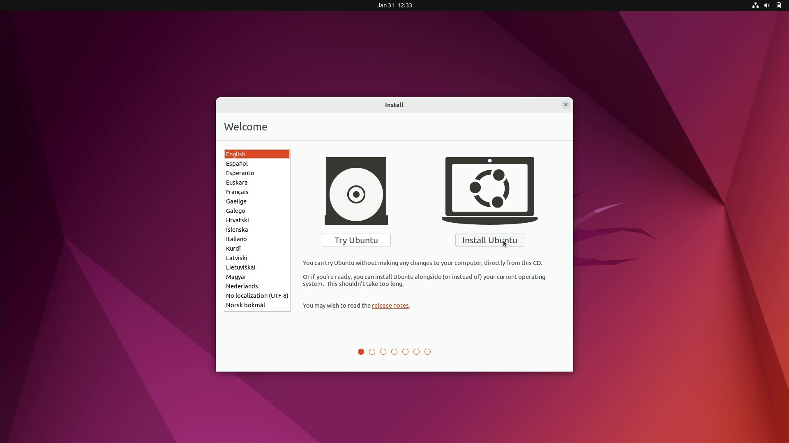

#### Choose keyboard layout and click “Continue”

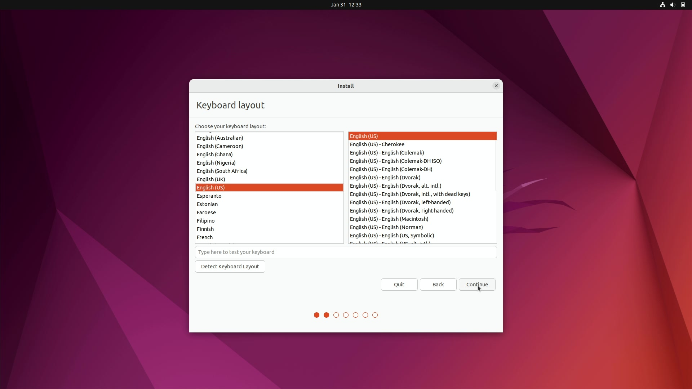

#### Select “Minimal installation” and click “Continue”

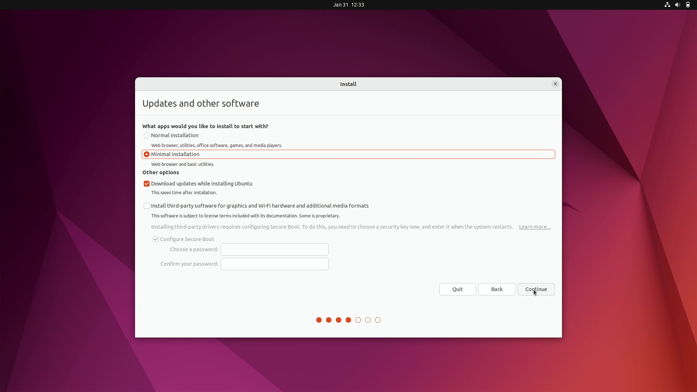

#### Select “Something else” and click “Continue”

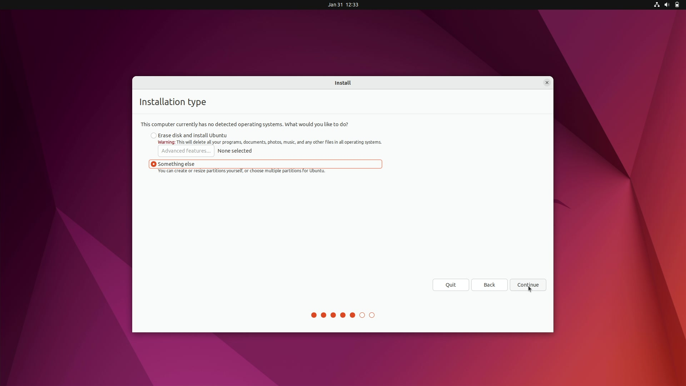

#### Delete all partitions on USB flash drive on which Ubuntu for desktops is being installed

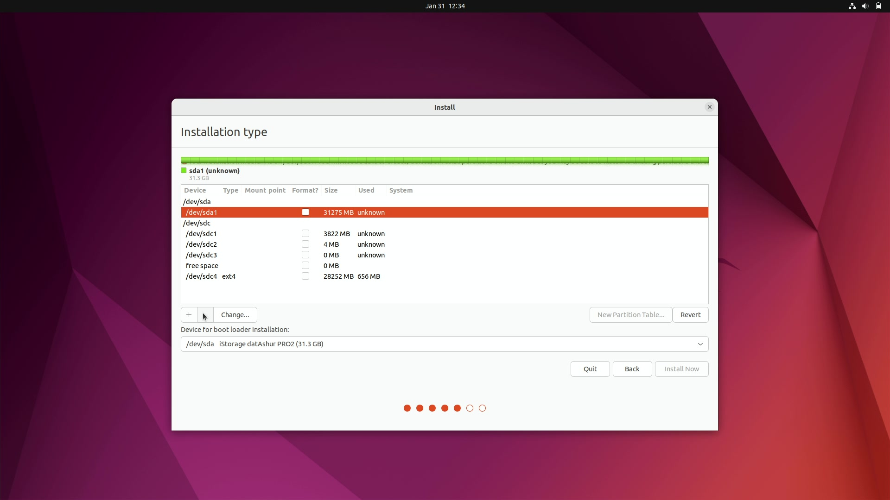

#### Create 512MB EFI partition on USB flash drive on which Ubuntu for desktops is being installed

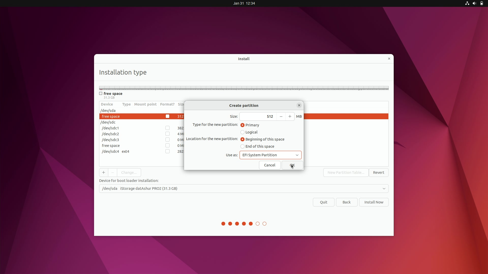

#### Create ext4 partition and set mount point to `/` on USB flash drive on which Ubuntu for desktops is being installed


#### Choose “Device for boot loader installation” and click “Install now”

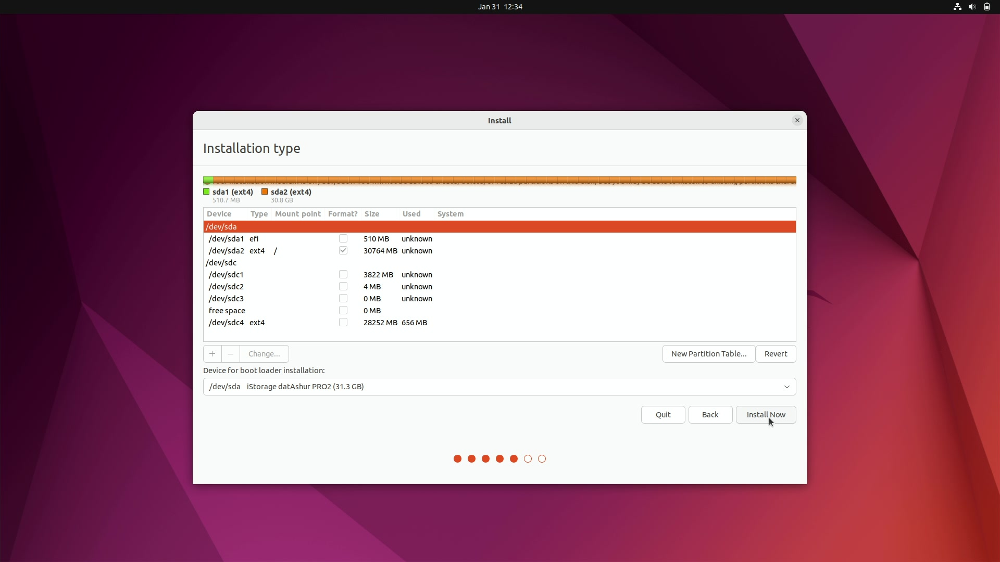

#### Confirm changes about to be written to disk and click “Continue”

> WARNING: make sure changes only apply to USB flash drive on which Ubuntu for desktops is being installed.

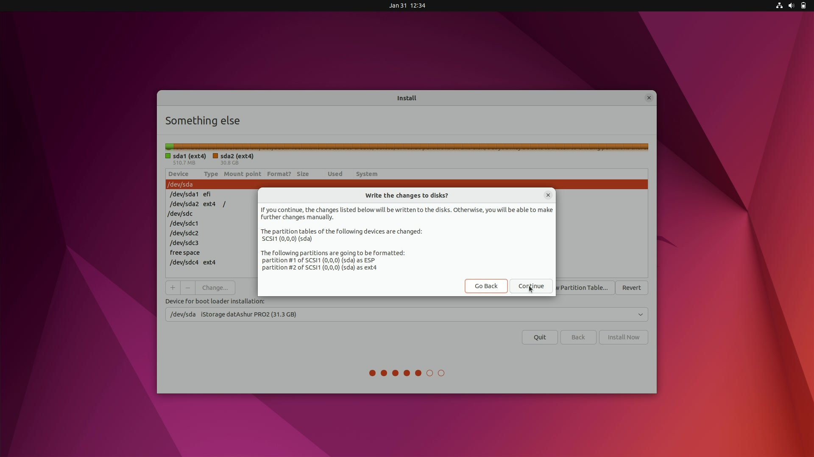

#### Choose timezone and click “Continue”

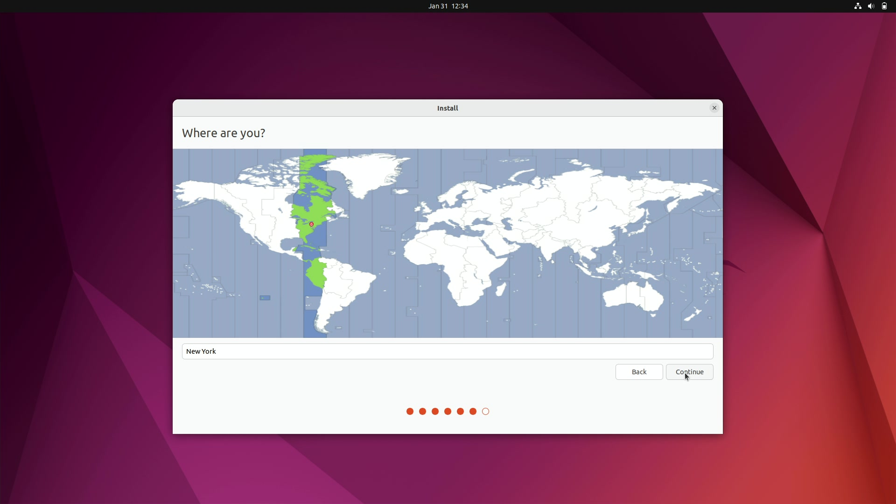

#### Choose credentials, select “Log in automatically” (optional) and click “Continue”


#### Reboot

## Configuration guide

### Step 1: disable telemetry

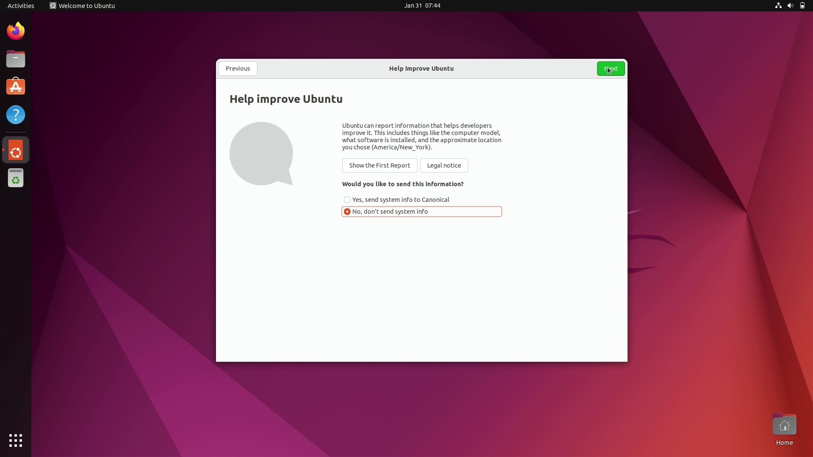

### Step 2: run `update-manager` and click “Install Now”

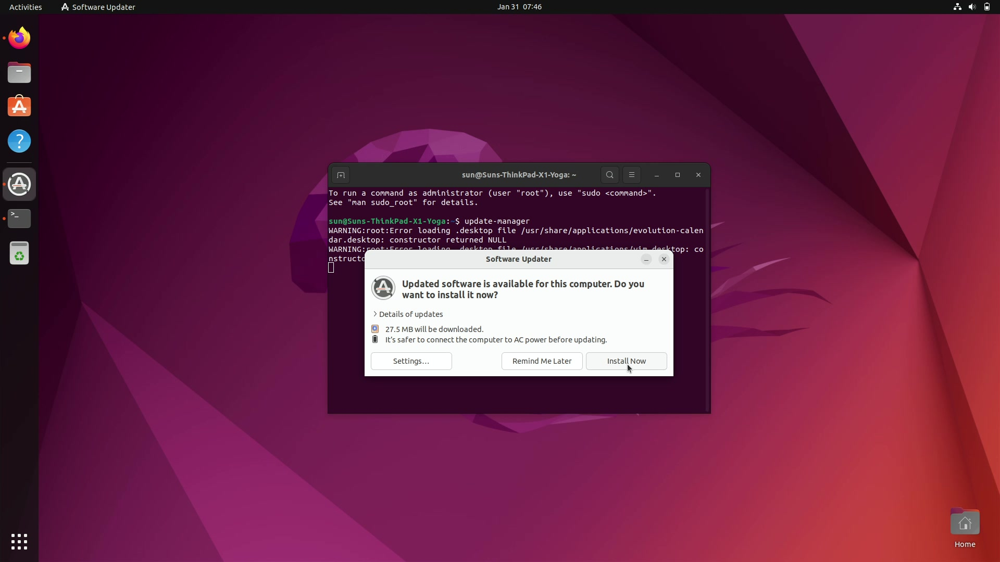

### Step 3: reboot

### Step 4 (if applicable): enable “Boot Order Lock”

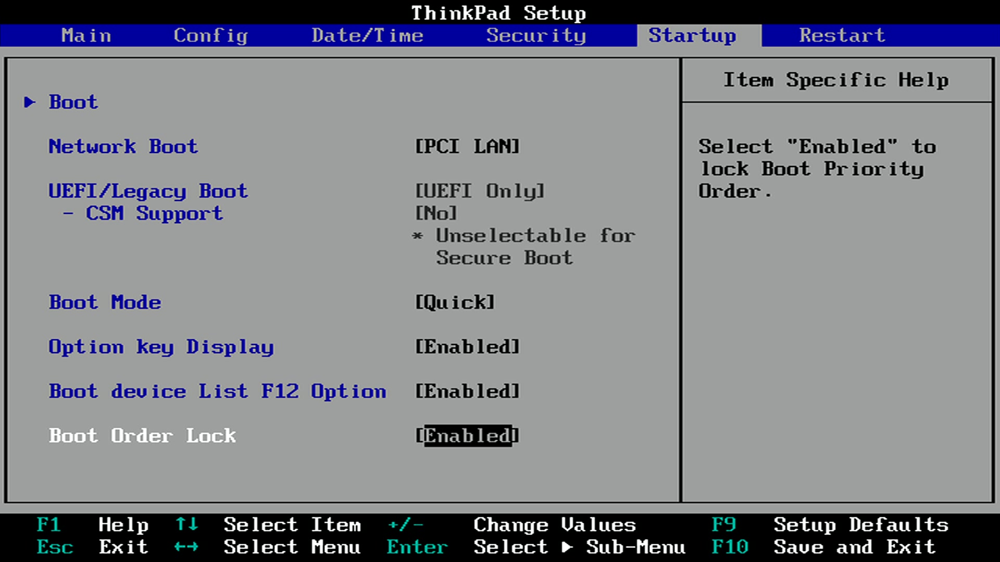

### Step 5 (optional): center new windows

```shell-session
$ gsettings set org.gnome.mutter center-new-windows true
```

### Step 6 (optional): enable dark mode

```shell-session
$ gsettings set org.gnome.desktop.interface color-scheme prefer-dark

$ gsettings set org.gnome.desktop.interface gtk-theme Yaru-dark
```

### Step 7: disable auto-mount

```shell-session
$ gsettings set org.gnome.desktop.media-handling automount false
```

### Step 8: add `universe` APT repository

```shell-session
$ sudo add-apt-repository -y universe
```

### Step 9: install `curl`, `libfuse2`, `overlayroot` and `zbar-tools`

```shell-session
$ sudo apt install -y curl libfuse2 overlayroot zbar-tools
```

### Step 10 (if applicable): download [Superbacked](https://superbacked.com/) and allow executing `superbacked.AppImage` as program

#### Download Superbacked

> Heads-up: replace `ABCDEFGH` with your license code.

> Heads-up: for additional security, [verify](/faq/release-integrity) Superbacked download.

```shell-session
$ curl --fail --location --output ~/Desktop/superbacked.AppImage "https://superbacked.com/api/downloads/superbacked-std-x64-latest.AppImage?license=ABCDEFGH"
```

#### Allow executing `superbacked.AppImage` as program

Right-click “superbacked.AppImage”, click “Properties”, click “Permissions” and, finally, select “Allow executing file as program”.

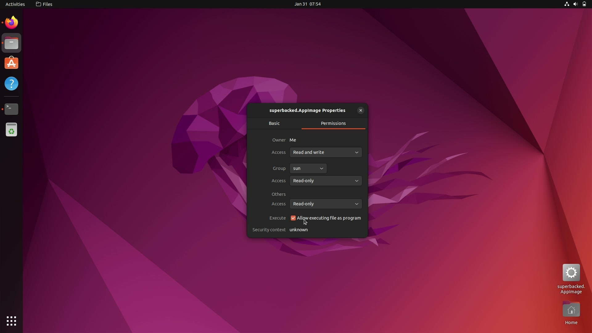

### Step 11: set `ext4` and `vfat` filesystems to read-only

```shell-session
$ sudo sed -i 's/errors=remount-ro/errors=remount-ro,noload,ro/g' /etc/fstab

$ sudo sed -i 's/umask=0077/umask=0077,ro/g' /etc/fstab
```

### Step 12: disable `fsck.repair`

```shell-session
$ sudo sed -i 's/quiet splash/quiet splash fsck.repair=no/g' /etc/default/grub

$ sudo update-grub
```

### Step 13: set `overlayroot` to `tmpfs`

```shell-session
$ sudo sed -i 's/overlayroot=""/overlayroot="tmpfs"/g' /etc/overlayroot.conf
```

### Step 14: clear Bash history

```shell-session
$ history -cw
```

### Step 15: reboot

> Heads-up: filesystem will be mounted as read-only following reboot.

```shell-session
$ sudo systemctl reboot
```

### Step 16: shutdown

> Heads-up: filesystem is ready for optional hardware read-only hardening.

```shell-session
$ sudo systemctl poweroff
```

### Step 17 (optional): physically remove internal disk(s) and wireless interface(s) if not soldered to motherboard or disable interface(s) using BIOS if soldered

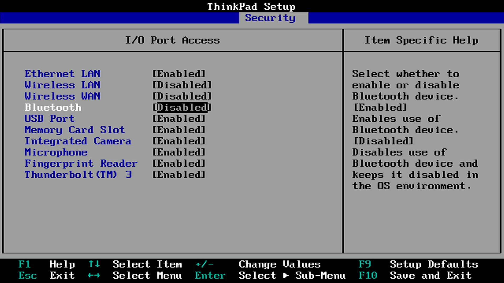

### Step 18 (optional): enable datAshur PRO² global read-only (see product [documentation](https://istorage-uk.com/product-documentation/) for instructions)

👍
